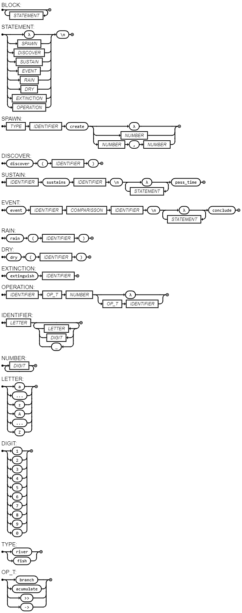

# Linguagem Autoral Aqua LogComp

## EBNF

``` 
BLOCK = { STATEMENT };
STATEMENT = ( "λ" | SPAWN | DISCOVER | SUSTAIN | EVENT | RAIN | DRY | EXTINCTION | OPERATION ), "\n" ;
SPAWN = TYPE, IDENTIFIER, "create", ( "λ" | NUMBER | NUMBER, ",", NUMBER ) ;
DISCOVER = "discover", "(", IDENTIFIER, ")" ;
SUSTAIN = IDENTIFIER, "sustains", IDENTIFIER, "\n", "λ", { ( STATEMENT ), "λ" }, "pass_time" ;
EVENT = "event", IDENTIFIER, COMPARISSON, IDENTIFIER, "\n", "λ", { ( STATEMENT ), "λ" }, "conclude" ;
RAIN = "rain","(", IDENTIFIER, ")" ;
DRY = "dry","(", IDENTIFIER, ")" ;
EXTINCTION = "extinguish", IDENTIFIER ; 
OPERATION = IDENTIFIER, OP_T, NUMBER, ( "λ" | OP_T, IDENTIFIER ) ;
IDENTIFIER = LETTER, { LETTER | DIGIT | "_" } ;
NUMBER = DIGIT, { DIGIT } ;
LETTER = ( "a" | "..." | "z" | "A" | "..." | "Z" ) ;
DIGIT = ( "1" | "2" | "3" | "4" | "5" | "6" | "7" | "8" | "9" | "0" );
TYPE = ( "river" | "fish" ) ;
OP_T = ( "branch" | "acumulate" | ">>" | "->" ) ;

```

## Diagrama Sintático



## Introdução

A linguagem Aqua desenvolvida para a matéria Lógica Computacional, é uma linguagem que simula o mundo natural ao escrever o código, para programar nessa linguagem é necessário criar connjuntos de rios e peixes e definir as relações entre eles. A linguagem é composta por 2 tipos de declarações, a declaração de rios, a declaração de peixes.

Observação: A linguagem não possui necessidade de identação, porém é recomendado para melhor visualização do código.

Um exemplo comentado de código em Aqua é:

```
river x create 10 #cria um rio com 10 de água

river y create 10

x >> 5 >> y # O rio x transfere 5 de água para o rio y
discover(x) # imprime 5
discover(y) # imrime 15

x branch 5 # O rio x se divide em 5 rios
discover(x) # imprime 1
y >> 1 >> x # O rio y transfere 1 de água para o rio x
x acumulate 5 # x = x*5 (o rio x acumula 5 vezes a quantidade de água que ele tem)

fish z create 2,1 # cria uma população de 2 que consome 1 por individuo
fish f create 1,1 # cria uma população de 1 que consome 1 por individuo

x sustains z: # enquanto x sustentar z # para sustentar z é maior que 0 e z consome x no valor de seu consumo e aumenta seu numero em (população-população%2) (populaçãox = populaçãox + (populaçãox-populaçãox%2) )
    y >> 1 >> x:
    f -> z    # f consome z para aumentar seu numero da mesma maneira do suatains
    event z inf f # caso população de z é inferior a f inicia um evento
        extingish f # f é extinto (delete f)
        conclude # fim do evento
pass_time # passa o tempo (recomeça o loop)

rain(y) # todos os rios recebem valor de agua equivalente quantidade em y

dry(x) # todos os rios perdem valor de agua equivalente quantidade em x

```

Um exemplo limpo de código em Aqua é:

```
river x create 10
river y create 10
x >> 5 >> y
discover(x)
discover(y)
x branch 5
discover(x)
y >> 1 >> x
x acumulate 5
fish z create 2,1
fish f create 1,1
x sustains z:
y >> 1 >> x:
f -> z   
event z inf f 
extingish f
conclude
pass_time
rain(y)
dry(x)

```